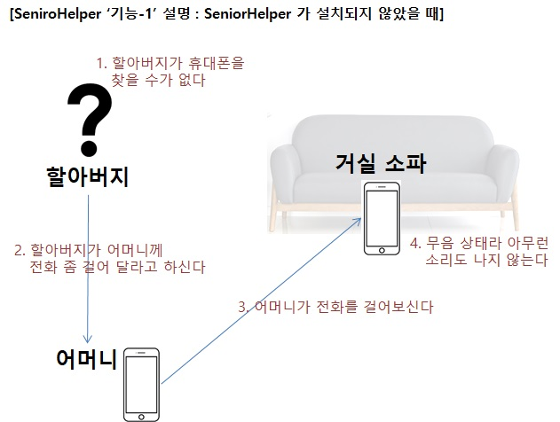
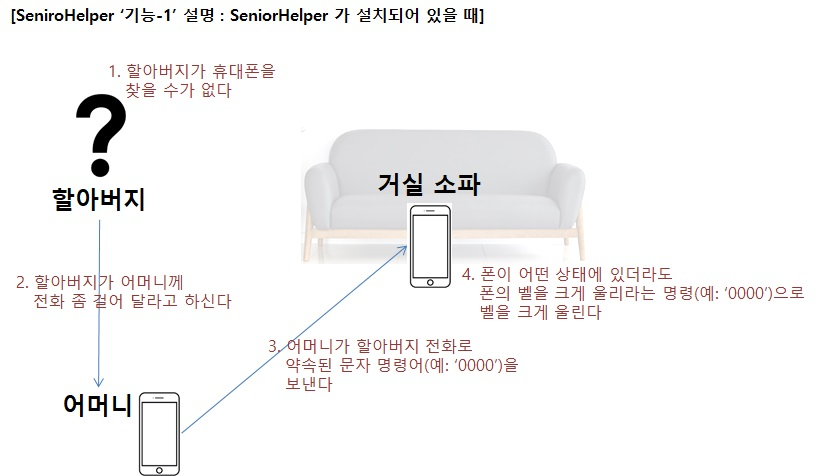
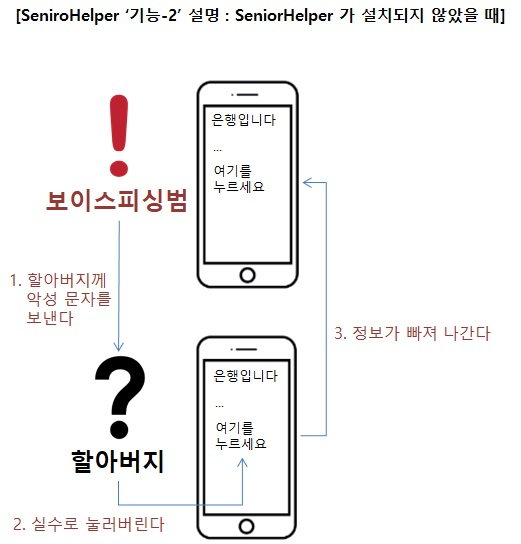
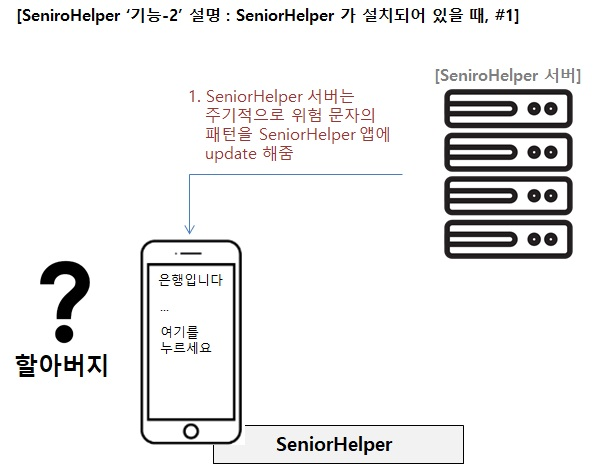
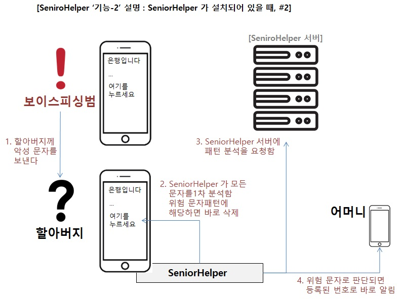
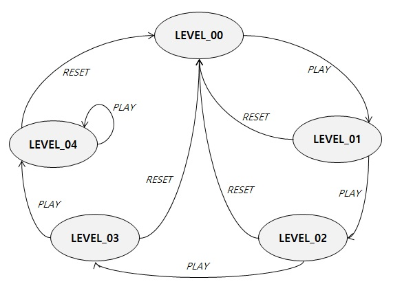

# SeniorHelper
이 프로그램은 시니어 분들의 불편을 도와드리는 기능을 제고하는 것을 목표로 합니다

시니어헬퍼 프로그램은 내가 오래 전부터 생각해 온 창업아이템을 실제로 구현하는데 필요한 기술을 하나씩 구현해 나가는 프로젝트를 진행해보기 위해서 시작한 프로그램이다. 내가 생각하는 시니어헬퍼 프로그램의 기능은 현재는 두 가지이고 다음과 같다.

1.	[기능-1] 깜빡깜빡 핸드폰을 어디에 두었는지 몰라서 찾아야 할 때, 쉽게 찾을 수 있게 도와주는 기능
2.	[기능-2] 할아버지, 할머니들에게 자주 오는 보이스피싱 문자메시지를 걸러내서 지워버리거나 가족들에게 문자나 전화로 위험을 알려주는 기능

이 프로그램을 창업아이템으로 생각한 이유는 다음과 같다.

작년 어느 날의 우리 가족의 이야기이다. 외할머니께서 엄마에게 전화를 하셨다. 아무래도 보이스피싱 문자를 모르고 뭘 눌렀는데, 그 다음부터 전화기 기능이 뭔가 이상해 졌다는 내용이었다. 엄마는 할머니께 왜 이상한 문자를 눌렀냐고 짜증을 내시며 말을 하셨고, 그 일로 한바탕 시끄러웠던 기억이 있다. 결국 할머니를 모시고 A/S 센터에 가서 스마트폰을 초기화해서 해결을 하셨다고 했다. 나는 곰곰이 생각해 보았다. 만약, 내가 안드로이드앱을 개발해서 어르신들이나 장애가 있으신 분들의 스마트폰에 깔고, 날아오는 모든 문자의 패턴을 분석해서 이상한 문자로 인식되면 위험도에 따라서 바로 삭제를 하던가 아니면 자녀들의 폰으로 경고메시지를 날리도록 하면 어떨까? 아니, 더 나아가서 서버에서 주기적으로 위험한 메시지의 패턴을 스마트폰앱으로 전달해서 최신 유행하는 보이스피싱 메시지를 잘 인식할 수 있도록 해주어 처리하면 어떨까? 그리고, 거기에 더해서 외가에 놀러갔을때 할머니 할아버지가 핸드폰을 무음이나 진동으로 해 놓은 상태에서 어디에 두셨는지 잊어버려서 힘들어하시는 모습을 자주 보게 되었고 그걸 도와드리는 기능도 생각하게 되었다.

그 동안 수도 없이 이런 소프트웨어를 만들려면 어떤 기술을 어떻게 구성해야 하며, 내가 어떤 공부를 해야 하는지를 찾아보고 정리하고 물어보는데 많은 시간이 걸렸다. 그 동안의 노력한 결과와 과정을 정리하고자 이 프로젝트를 시작하게 되었다.

이 프로젝트의 최종 목표까지의 기술은 아직은 내가 모두 구현하기에는 역량이 부족하다. 때문에 이 두 개의 기능을 각각 단계별로 나눠서 구현하고자 한다.
서버의 기능이 필요 없는 [기능-1]을 먼저 구현하고, 그 후에 [기능-2]의 서버의 기능과 보이스피싱의 패턴을 분석하고 판단할 수 있는 AI 기능까지 접목을 시키려면 관련 고등학교를 진학하거나 해당 분야에 대한 훨씬 더 깊이 있는 공부의 시간이 필요하다고 생각한다.
따라서 지금부터는 [기능-1]에 초점을 맞추어서 그것을 구현하는 단계별 목표를 세우고 그 계획에 맞게 필요한 기술을 습득하고 적용해 보면서 이 프로젝트를 진행해 나갈 계획이다.
   

## 기능-1 : 스마트폰 찾기 기능 설명
어른들이 스마트폰을 어디에 두었는지 모르는 상황에서 대부분은 아래와 같은 방법으로 해결하려고 한다.
 
<kbd>

</kbd>
  
그러나, 이런 방법에서의 최대 단점은 스마트폰이 묵음 혹은 진동으로 되어있을때, 특별히 효과가 있는 방법이 되지 못했었다.

이러한 단점을 보완할 방법으로 아래와 같이 미리 SeniorHelper 를 설치해 둔 스마트폰은 쉽게 폰의 위치를 알 수 있도록 도와준다.
 
<kbd>

</kbd>
   

## 기능-2 : 보이스피싱 방지 기능 설명
보이스피싱은 그 방법이 다양하여 어떤 때에는 택배와 관련된 문자로 악성 프로그램의 설치를 유도하고, 어떤 때에는 카드결제와 관련된 내용, 또 어떤 때에는 은행통장 인출과 관련된 내용으로 어른들을 속이는 문자를 보낸다.
현재는 아래와 같이 어른들이 쉽게 문자에 속아서 그 내용을 클릭하고 그로인해 악성 프로그램이 설치되어 피해를 당하게 되는 일이 많았다.
 
<kbd>

</kbd>
  

이런 문제를 해결할 방법으로 SeniorHelper 는 2단계의 보호를 실행한다.
첫번째는 주기적으로 서버로부터 악성 문자의 패턴을 아래와 같이 받아서 그 패턴에 해당하는 문자를 되도록 바로 삭제해 버려서 어른들이 그 문자를 접하지 못하게 하는 방법이다.
 
<kbd>

</kbd>
  
두번째는 위험이 감지되는 문자는 서버로 전송하여 분석을 의뢰하고 위험의 가능성이 있다고 판단되면 SeniorHelper에 저장된 가족의 폰으로 경고 메시지를 보내는 방법으로 아래 그림이 그 과정을 설명해 준다.
  
<kbd>

</kbd>
 

# [기능-1] 스마트폰 찾기 기능 디자인
이 기능은 나의 스마트폰을 어디에 두었는지 모르는 상황에서 다른 사람의 폰으로 미리 정해둔 문자를 보내면 진동이 울리거나 벨소리를 크게 나게 함으로써 폰의 위치를 쉽게 찾을 수 있도록 도와주는 기능이다.
예를 들어, 스마트폰 A를 어디에 두었는지 모른다고 가정한다. 스마트폰 B를 이용해서 A에게 '0000'을 PLAY 명령으로 인식해서 진동이나 벨소리를 나게하고, '9999'를 보내면 RESET 명령으로 인식해서 진동이나 벨소리를 멈추게 하는 기능으로 이해하면 된다.
이를 위해서 SeniorHelper 는 SMS 메시지를 모두 받을 수 있는 기능을 구현할 것이고, 그 메시지를 분석해서 명령어로 인식되면 해당 명령의 동작을 하게 된다.

기본적인 명령어와 그 명령어에 의한 동작은 아래와 같다.
아래와 같이 두개의 명령어가 존재한다.
- PLAY  : '0000' 문자메시지를 PLAY 명령으로 인식한다
- RESET : '9999' 문자메시지를 RESET 명령으로 인식한다

이때, PLAY 명령어는 반복적으로 보낼 수 있는데, 반복되는 횟수에 따라서 SeniorHelper 는 다른 동작을 한다. 왜냐하면, 너무 한번에 최대 볼륨의 벨소리를 내면 놀라거나 주변에 피해를 줄수도 있기 때문이다.
때문에, 아래와 같이 PLAY의 횟수에 따라서 상태가 변경된다.
 
<kbd>

</kbd>
  
각 상태의 동작은 아래와 같이 정의하였다.
- LEVEL_00, // 대기 상태
- LEVEL_01, // 진동을 울린다
- LEVEL_02, // 낮은 볼륨으로 벨소리를 낸다 (최대 볼륨의 1/3로 울린다)
- LEVEL_03, // 중간 볼륨으로 벨소리를 낸다 (최대 볼륨의 2/3로 울린다)
- LEVEL_04, // 최대 볼륨으로 벨소리를 낸다 (최대 볼륨으로 울린다)

즉, 처음 SeniorHelper 를 설치한 상태는 LEVEL_00 상태이고, 이때는 대기 상태라고 할 수 있으며, 아무런 동작도 하지 않는다.
그러다가 첫번째 PLAY 명령이 들어오면 진동을 울리고, 그 다음 PLAY 명령이 오면 낮은 볼륨의 벨소리를 울리고, 세번째 PLAY 명령이 오면 중간 볼륨으로 벨소리를 울리고, 네번째 PLAY 명령이 오면 최대 볼륨으로 벨소리를 울려준다.
이러한 과정의 중간에 언제라도 RESET 명령이 오면 LEVEL_00 상태, 즉 진동이나 벨소리를 모두 멈추고 대기상태로 돌아가게 된다.

